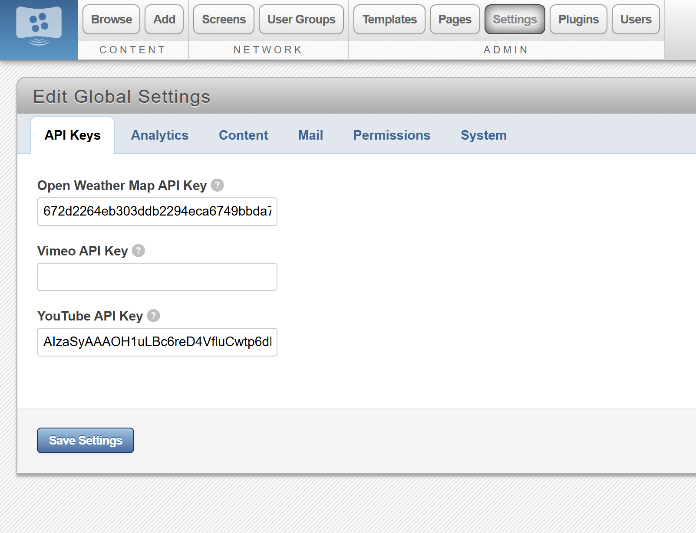

Video Testing suggestions.\n
If video playback doesn't work, here are some possible fixes.\n
Youtube/Vimeo Videos can't be submitted:\n
    Check to make sure the API keys are present. If not, replace them.
    
Youtube videos load, but don't play unless manually started:
    Many browsers have settings to prevent autoplay. Make sure that autoplay is enabled
        On Microsoft Edge: go to Media autoplay and set it to "Allow"
        On Google Chrome: click on the emblem next to the url of the desired website, and go to site settings. Switch sound from "Automatic" to "Allow".
