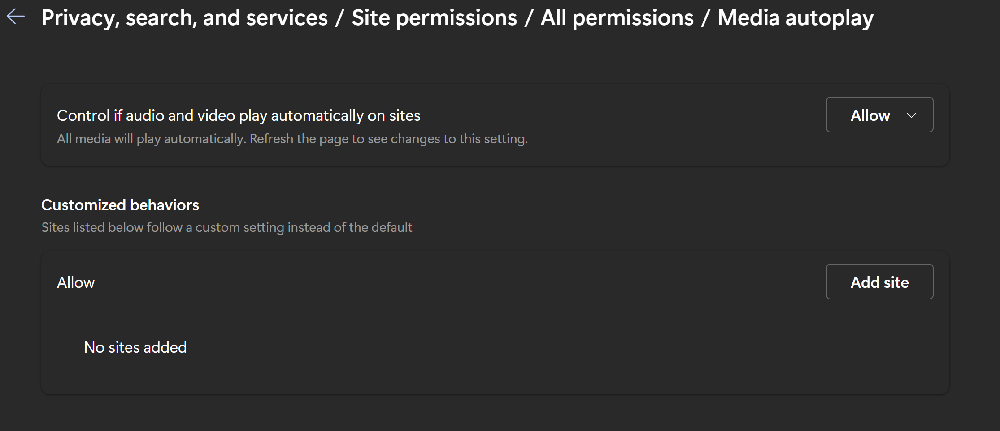
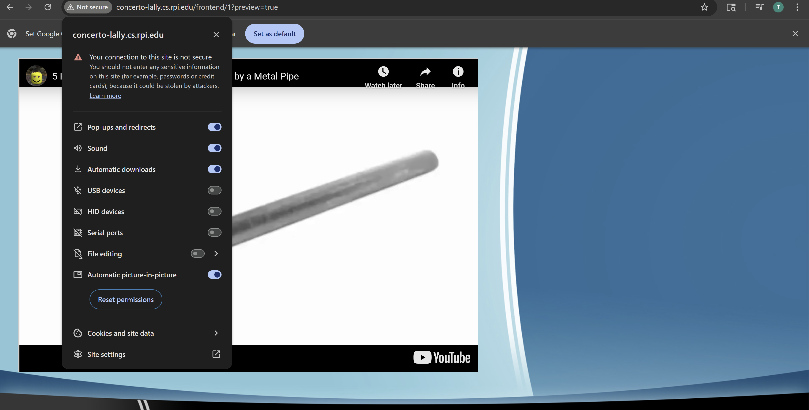
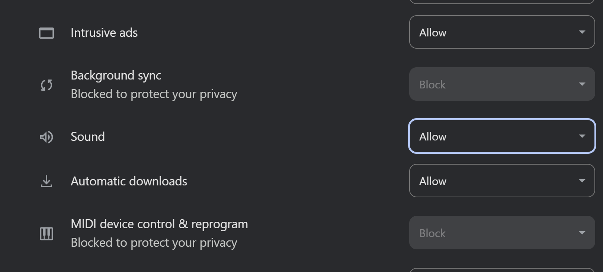

Video Testing suggestions.\
If video playback doesn't work, here are some possible fixes.
- Youtube/Vimeo Videos can't be submitted:
- - Check to make sure the API keys are present. If not, replace them.\
\
- Youtube videos load, but don't play unless manually started:
- - Many browsers have settings to prevent autoplay. Make sure that autoplay is enabled
- - On Microsoft Edge:
- - - Go to Media autoplay and set it to "Allow"\
\
- - On Google Chrome(or any Chromium browser):
- - - Click on the emblem next to the url of the desired website, and go to site settings.\
\
- - - Switch sound from "Automatic" to "Allow".\
\
